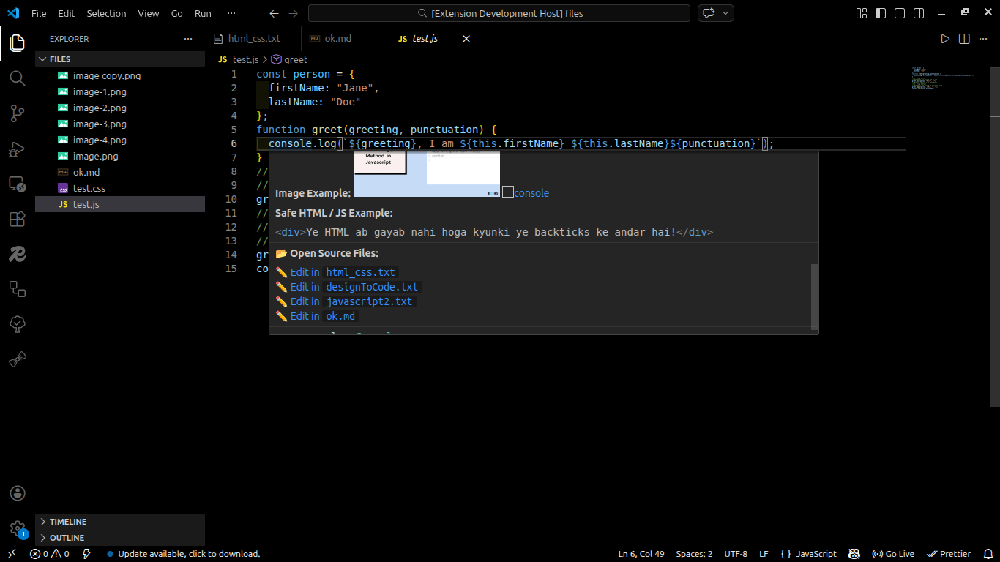
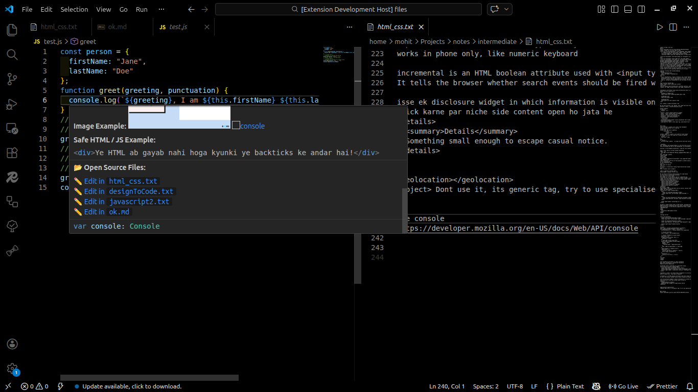

# Smart Syntax Memory & Context Notes

A context-aware intelligent autocompletion tool for JavaScript, TypeScript, CSS, and HTML that remembers what you type and prioritizes your most used properties and methods.
U can see its code on my github and edit as u want
https://github.com/MohitSingh34/syntaxMemoryJS.git

## Demo

see in good quality
https://youtu.be/ZJg5khUn0G0
https://drive.google.com/file/d/1fQv_4y4V5MaSWkvGQ0Zras-V6pHztizP/view?usp=drive_link


If i right clicks on image on web and copies it and pastes it in md file, it pastes as this
`` without ` these marks
but they not loads in popup.
for popup u have to give image path like this 

or if u want to paste a browser image then first download or save as or copy in actual directory and then copy its path and paste in markdown file

 

## Features

- **Context-Aware Suggestions:** Recognizes if you are typing after `Math.`, `console.`, or a custom variable, and provides relevant history.
- **Frequency-Based Priority:** Your most frequently used methods are automatically pinned to the top of the IntelliSense list with a 🔥 icon.
- **Smart Hover Notes:** Write your personal notes in a dedicated file using the `@de <word>` syntax. Hover over that word in your code to instantly peek at your notes!
- **Split-Screen Notes:** Click the link inside the hover tooltip to open your full notes file right beside your code, automatically scrolled to the exact definition.
- **Memory Dashboard:** Run `Syntax Memory: View Usage History` from the Command Palette to see a clean breakdown of all your heavily used methods and the exact files they were used in.

## How to Set Up Notes

1. Create a simple text file anywhere on your system (e.g., `js_notes.txt`).
2. Add notes using this exact format:

   ```text
   @de console
   Use console.table(arr) to display arrays neatly.

   @de log
   //Some notes
   ```

Delete node_modules and package-lock.json
then cd into the directory where package.json is located
npm install
press F5 to run extension

## License

This project is released under the **GNU General Public License v3.0 (GPLv3)**. See the [LICENSE](LICENSE) file for details or visit https://www.gnu.org/licenses/gpl-3.0.txt.
